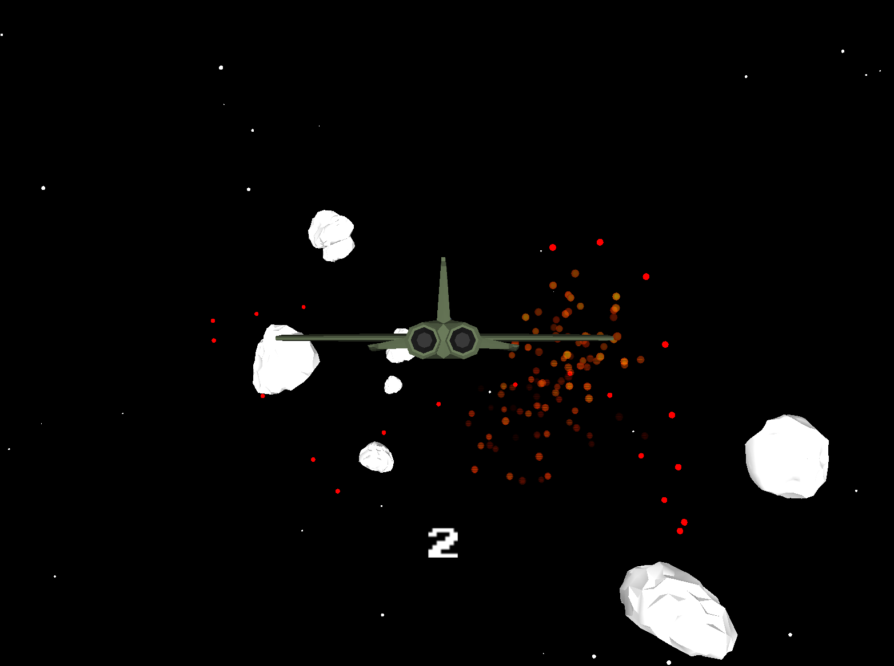

# ANova Space Adventure

**An endless space flyer for the Arduino joystick! Navigate your jet through an asteroid field. Destroy asteroids and survive! How far can you get?**

  
  
  
  

## JoyStick Serial Input Script (Arduino Script)

### How To
- Upload `joyStickSerial/joyStickSerial.ino` to your Arduino. This script can be downloaded from this repo or the [itch.io](https://joel-ca.itch.io/anova-space-adventure) page
- Refer to the below diagram for the hardware setup for the controller:

- Set your Serial Monitor baudRate = 115200 and verify you can see the raw input stream
  + You can set the baud rate in the Arduino IDE's Serial Monitor by finding baud rate in the bottom right corner of the Serial Monitor window

### Features

- Neatly packages raw sensor data from the two potentiometers and button that make up the Arduino joystick into discrete values for forwarding to other applications

- In the case of Anova Space Adventure, this script **acts as the mediator between the controller and the game**

## Anova Space Adventure (Processing Application)

### How To
- Download the executable and dependencies in your operating system's version (only Windws and Linux supported) from the [itch.io](https://joel-ca.itch.io/anova-space-adventure) page
- (Optionally) create a shortcut of the executable (`anovaSpaceAdventure.exe` on Windows or `anovaSpaceAdventure` ELF on Linux) to your desktop for ease of access
- Run the executable
- You will be prompted to select the port your Arduino is plugged into, select the right one (you can see which it is from the Arduino IDE)
- Joystick up/down to navigate the menu and joystick down-press to make a selection
- In settings you can toggle music, soundFX, and the visibility of in-game object bounding boxes
- Use joystick up/down/left/right to controll jet pitch and yaw. Down-press joystick to fire layer darts. Hit asteroids with lasers to score points. If your jet collides with an asteroid you loose. Godspeed adventurer! 

### Features

#### Dynamic Serial Port Selector

  + Pop-up window at application startup prompts user to select the port the Arduino is connected to from a list of all available ports

#### Custom 3D models, sound effects, and procedurally infinitely looped music

  + Implemented cross-fade audio transition effect across 3 variants of the game loop track for a seamless unique music experience at every play run

  + Music and sound effects can be toggled on/off in the menu

  + Music/soundFX preferences saved to disk via a .txt file so they are preserved across application sessions

#### Explosion Particle simulation animations

  + Interpolate particle colors from bright to dim across every particle's randomly (but bounded) lifespan for a smooth dissipation effect

  + Every particle moves away from its parent object (jet or asteroid) centroid in a random direction

#### Arduino-controlled Jet transformations (pitch, yaw, and fire)

  + Important Context

    - The Arduino joystick outputs a raw x and y value, both ranging from 0-1023 (where ~512 is the joystick at rest along that axis and 0 and 1023 represent the joystick being yoinked to either end's most extreme position)

    - Joystick also outputs "button pressed?" boolean (0 or 1)

  + The raw 0-1023 x and y values are mapped to values between -pi/4 and pi/4 to determine the pitch (y) and yaw (x) angles

  + The direct conversion to angle is passed through an easing *lerp* function for smoother rotations

  + If the button is pressed, a new projectile object is instantiated with a velocity vector set in the same direction as the jet forward vector (with a short cooldown to prevent spam)

    - Projectile objects despawn when outside the viewing frustum (clipped at a depth of 1000 units into the scene) for performance

#### Procedurally generated infinite asteroids

  + One of 5 asteroid meshes is selected at random upon asteroid object initialization

  + Randomly spawned between 1000 and 4000 units from the player

  + Slow rotation animation and constant movement toward the player (though direction is dependent on inverted jet pitch/yaw for illusion of movement in relation to asteroids)

  + Constant number of asteroids at any given point; objects recycled when they are out of view or explode

#### Procedural star background animation

  + Similar to asteroid logic, but random positions are wider to occupy spots in the entire viewing frustum, but excluding some of the center of the frustum to avoid visual glitches (e.g., star flying through the jet) and for overall visual appeal

#### Collision detection (jet-asteroid and projectile-asteroid)

  + To keep things computationally simple, 3D geometric primitives were used as bounding volumes for collision detection

  + These bounding volume visualizations can be toggled on/off in game settings (alongside line-of-sight)

  + A sphere roughly fits asteroids

  + A height-thin and width-long rectangle roughly fits the jet

  + Hence, jet-asteroid collision detection reduced to sphere-rectangle collision detection

    - Requires a check for if points within the radial distance from the sphere center are bounded by all sides of the box

  + And projectile-asteroid collision detection reduces to a simple distance check: is the projectile's distance from the sphere center less than the radius of the sphere?

#### (High) Score tracking

  + Bright neon text shows off high scores when newly achieved

  + Current score displayed in-game

  + This is also saved to disk alongside preferences for high score retention across game sessions

#### Dynamic in-game objects/GUI element resizing based on live window resizing

#### Portably packaged into .exe (Windows) for ease of sharing

  + It even comes with a custom icon if you make a shortcut to your desktop!

## Future work:

- Progressively more difficult gameplay

  + e.g. a greater number of asteroids and jet moving faster the farther along you get

- TBH, the main file, anovaSpaceAdventure.pde, is a bit of a mess right now. It's a mix of gameState, object collision, GUI, sound, Serial, save data, log data, and window resizing, management. I've remedied what was once before an even more atrocious main file by making object files for all the in-game entities (i.e. Asteroid, Jet, Particles, Projectiles), but if future collaborators wish to maintain and develop Anova Space Adventure further, it would be certainly worthwhile to re-organizing the work of the main file into different Manager classes. I've even drafted an AudioManger class, but with the base game working to my liking, I won't be reorganizing further for now.
- Simple bounding volumes are cheap, but will occasionally lead to noticable imprecesion (e.g. jet clips through top of long asteroid without exploding). I considered implementing a BVH to get the best of both precesion and affordable computation, but have decided to leave this to future work instead since current approach is good probably over 95% of the time.

### 🐛 Known Bugs/Limitation(s):

TL;DR: Most joystick Serial issues can be resolved by restarting the application. For your convenience, **pressing 'r' on your keyboard will restart the application automatically** (on Windows anyways-- you'll probably need to manually restart on Linux OS).

- If you unplug your input device/Arduino while running the application, the application will not be able to re-detect serial input even after plugging your device back in. Instead, restart the application and reselect your port. Alternatively, don't unplug your controller mid-game.

- If you select the wrong port at application startup, you will have no in-game controls, or the application will act according to random input noise, or the application will freeze up attempting to open the port. In any of these cases, simply restart the application and select the correct port.

- There are often noisy controller Serial inputs into the application when it is first loading up. There are some ignore input warm-up periods in place to prevent undesired selections, but if controller noise persists, then restart the application (there have been times when I had to restart the application several times before noise subsided).

## Credits  

### **ANOVA SPACE ADVENTURE**  

**Original game by Joel Castro**  

### 3D Models  

**Courtesy of Sketchfab**  

- *8 Low Poly Asteroids* by **Everios96**  

**Courtesy of Turbosquid**  

- *Jet low-poly* by **funbug3d**

### Music & Sound FX  

**Courtesy of [Freesound.org](https://freesound.org)**  

- *"Space Jam Loop [1, 2, & 3]"* by **LuckyLittleRaven**  

- *"Space Syndrome"* by **X3nus**  

- *"Space Station Ambiance (With Chords)"* by **RobboStar**  

- *SFX_Explosion_01* by **jalastram**  

- *explosion_asteroid [1 & 2]* by **runningmind**  

- *"Menu Select"* by **pumodi**  

- *"Blip 2"* by **AceOfSpadesProductions**  

- *"Laser"* by **Ashe Kirk @ Owlish Media**

---

© 2025 by **Berkeley ANova** with ❤️
